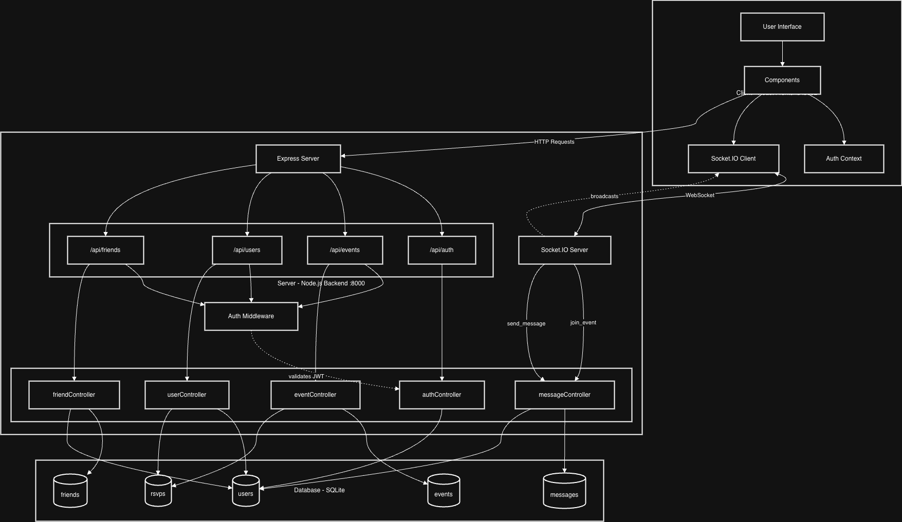

# Event Scout
Introducing Event Scout, a social media style event hub where anyone can post, find, RSVP to events near them. Event organizers post event flyers and details, attendees create an account and RSVP to certain events. Each event contains its own “group chat” where attendees can meet online beforehand. Private events can also be created that are only visible to a user's friends.

## Running Locally
### 1. Clone the repo: 
```bash
git clone https://github.com/jaydenspurgiasz/event-scout.git
cd event-scout
```

### 2. Backend Setup

Navigate to the backend directory and install dependencies: 
```bash
cd backend
npm install
```

Create a `.env` file in the backend directory:
```bash
PORT=8000
NODE_ENV=development
JWT_SECRET=your-secret-key-change-in-production
CLIENT_URL=http://localhost:3000
```
Alternatively, simply copy and paste the `.env.example` file into your `.env`

### 3. Frontend Setup

Navigate to the frontend directory and install dependencies: 

```bash
cd ../frontend
npm install
```

Create a `.env` file in the frontend directory:
```bash
REACT_APP_API_URL=http://localhost:8000
```
Alternatively, simply copy and paste the `.env.example` file into your `.env`

### 4. Start App
Run the backend and frontend at the same time

To start the backend server
1. Open the terminal window
2. Navigate to the backend directory: 
   ```bash
   cd backend
   ```
3. Start the server:
   ```bash
   npm run dev
   ```
4. The backend server will start on **port 8000**
5. You should see: `Server is running on port 8000`

To start the frontend server
1. Open a new terminal window (keep the backend running)
2. Navigate to the frontend directory:
   ```bash
   cd frontend
   ```
3. Start the development server:
   ```bash
   npm run start
   ```
4. The frontend will automatically open in your browser at **http://localhost:3000**

Once both servers are running:

1. Open your web browser
2. Navigate to: http://localhost:3000
3. You should see the Register/Login page
4. Select Register, enter the corresponding information, and press "Sign Up" to enter the homepage

## Running Tests

### Backend Unit Tests

To run the backend unit tests:

1. Navigate to the backend directory:
   ```bash
   cd backend
   ```

2. Run the tests:
   ```bash
   npm run test
   ```

### End-to-End (E2E) Tests

The project uses Playwright for end-to-end testing.

To run the E2E tests:

1. Navigate to the frontend directory:
   ```bash
   cd frontend
   ```

2. Run the E2E tests:
   ```bash
   npm run e2e
   ```

This command will:
- Start the backend server (on port 8000) with a fresh database
- Start the frontend development server (on port 3000)
- Wait for both servers to be ready
- Run the Playwright tests

**Note:** Make sure you are not already running the backend or frontend server before running the tests. They will not work as the ports the tests use will be taken.

## Diagrams
### System Architecture Diagram


This diagram shows the system architecture and how different components interact with each other

Frontend (React): 
Sends HTTP requests to the Express server for data operations and maintains WebSocket connections for real-time chats.

Backend (Node.js/Express): 
/api/auth - user registration and login
/api/events - Event CRUD operations and RSVP management
/api/users - user profiles and activity
/api/friends - friend requests and relationships

Auth Middleware validates JWT tokens for protected routes; controllers handle all the logic. 

Database (SQLite): 
Users (account information), events (event details), RSVPs (event attendance), and messages (chat history). Controllers will query the DB and return the results to the different API routes

Communication: 
HTTP/Rest APIs handle CRUD operations with JWT auth. 

### UI State Diagram


This diagram shows the different states of the UI interface and how the states change as you navigate through the UI.

The website starts at the choice page where the user can choose either to login or to register. In both paths there is a validation process before converging on the the home/eventlist page. From this page the user can go to either the create event page to create a new event assuming the user has input all required fields or the profile page. From the profile page the user can go the friends page where they can traverse to either the friend requests or friend search page. All pages have a back button to take it back to the previous state except for the home page and the first page (choice).